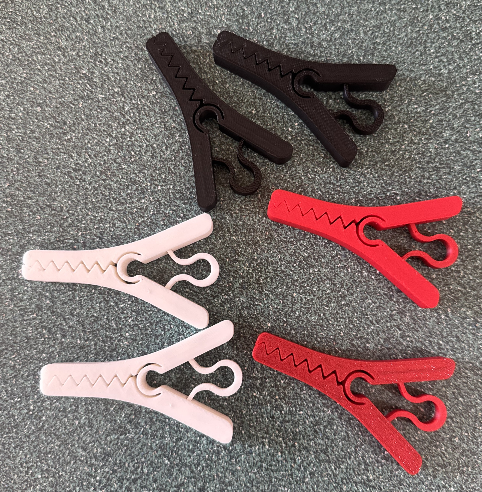
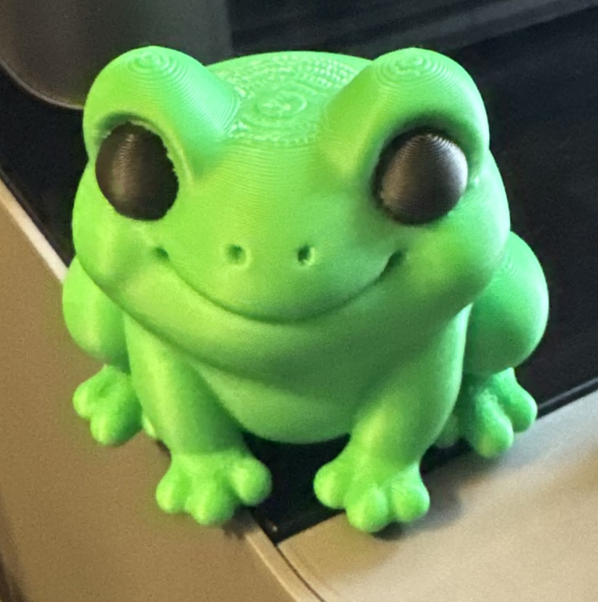
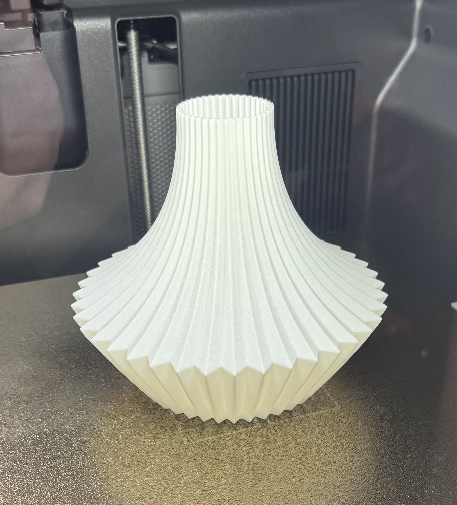
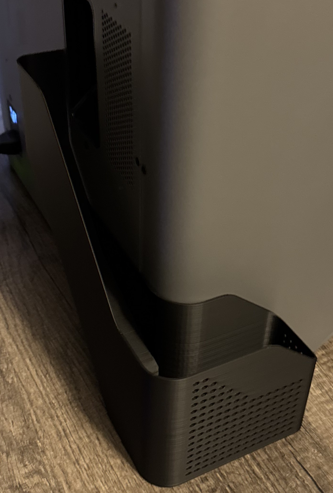
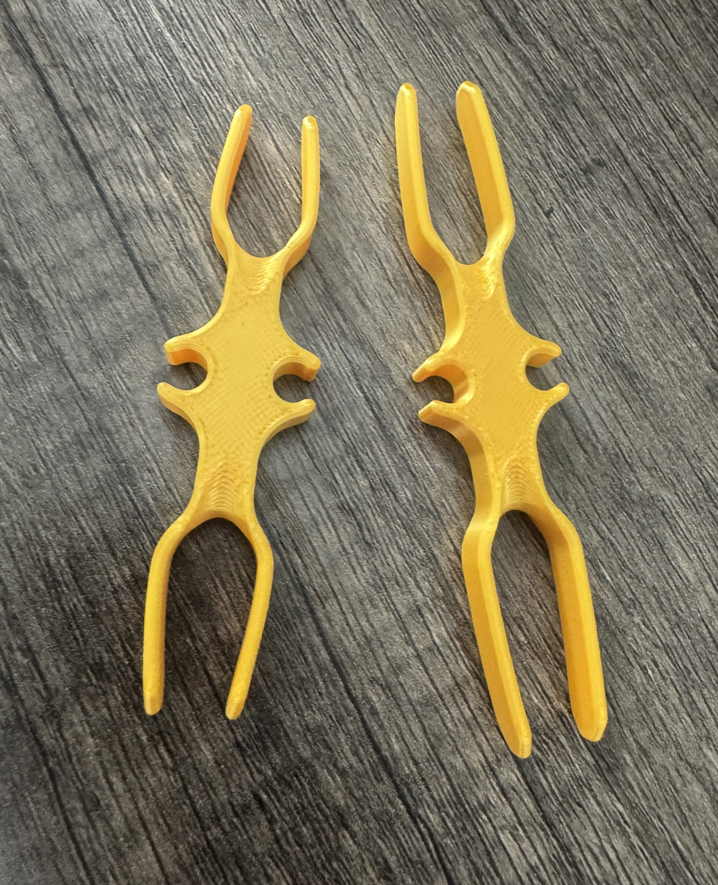
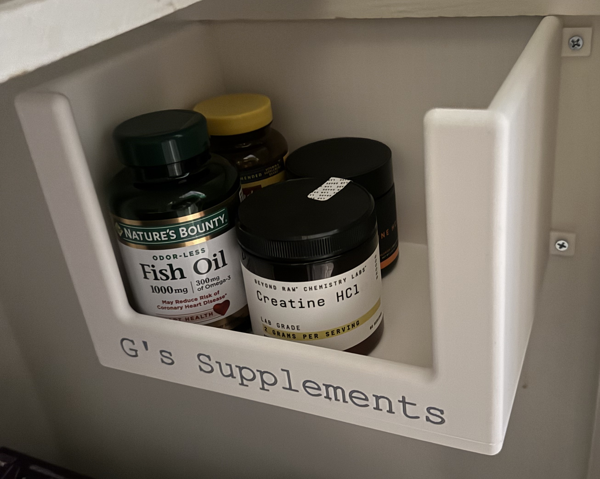
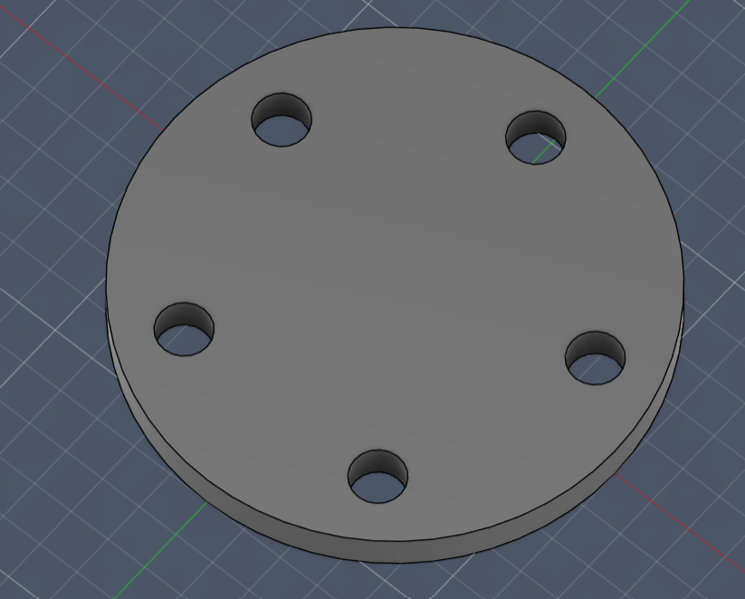
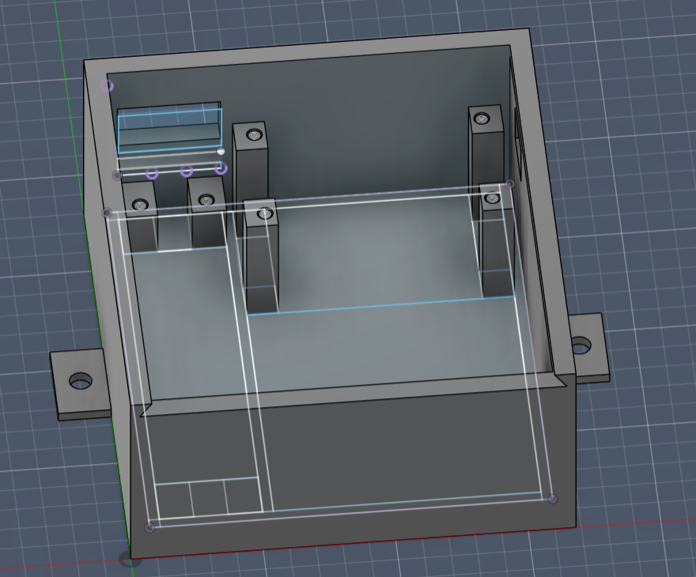
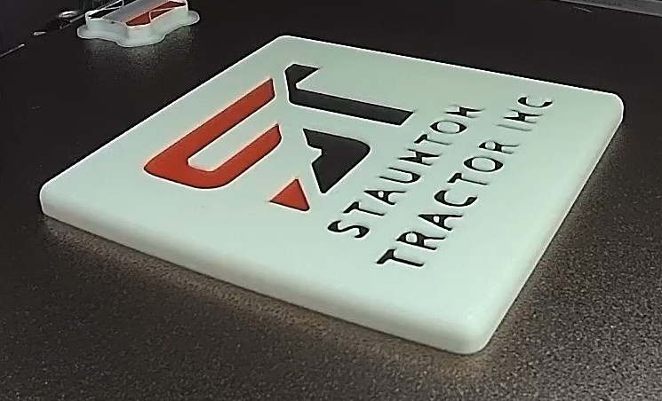

As part of working on various custom side projects, namely my [Smart Garage Door](../smart_garage_door/smart_home_custom_garage_door.md) project, I found the need to create my own housings for my projects. As I explored options for purchasing or creating custom housings for my projects, I found that it was expensive to purchase custom housings. Instead, it'd be a lot more customizable and fun to design my own parts and print them myself!

## How to get started

### Well... you need a printer!

To get started, like any other novice, I simply opened a browser of choice and searched "what's the best 3D printer for a beginner?". The search returned 3 main brands to investigate: Bambu, Creality, and Prusa. Thus began the hunt for a printer! 

After some research, and some extremely helpful advice by a former colleague, Garrett Serack, I found that there was one option that seemed relatively budget friendly and would also be, as Garrett Serack put it, "automagic". "Automagic", in this case, meaning that you could very easily get started by simply feeding it a 3D design and, with no customizations, it'd print with no issues!

The printer I decided on was the [Bambu Lab P2S Combo](https://us.store.bambulab.com/products/p2s?from=home_web_p2s_detail&id=664977091405410311). Check out a picture of my printer below!

> I'd highly recommend getting the combo, as it includes the [AMS 2 Pro](https://us.store.bambulab.com/products/ams-2-pro), which makes loading multiple filaments, auto-loading & auto-switching of colors during printing, **MUCH** easier.

### What about filaments? 

To begin with, I bought PLA Basic filaments that would allow me to print simple, fun parts. PLA Basic filaments are designed for simple parts that don't reqiure significant strength or temperature resistance, and will be primarily kept indoors. 

As I started printing more and more parts, I began to investigate other filaments and learn when they are useful.

#### Guide to various filaments

Below is a quick table explaining my perception of when certain Bambu Lab filaments are best used. Additionally, here is a link to the [Bambu Lab Filament Guide](https://bambulab.com/en-us/filament/guide).

| Filament Type | Best For | Pros | Tradeoffs |
|---|---|---|---|
| PLA Basic | General indoor prints, prototypes, fun prints | Easiest to print, affordable, good surface finish | Lower heat resistance, when it breaks it **breaks** |
| PLA Matte | Display pieces and aesthetic prints | Hides layer lines better, clean look | Very similar to PLA Basic |
| PLA Silk | Decorative/colorful models | Shiny finish | Similar to PLA Basic but slightly weaker |
| PETG HF | Functional parts, light outdoor use | Better heat resistance and more reliable breakage at edges of tensile strength | Requires drying as it absorbs more moisture |
| ABS | Durable mechanical parts | Good strength and heat resistance | Fumes should be avoided |
| ASA | Outdoor parts (sun/weather exposure) | UV/weather resistant, durable | Very similar to ABS |
| TPU 95A HF | Flexible parts (shoes) | Flexible, impact resistant | Due to softness, can be tricky to print |

There are many more variations of filaments offered by various providers, not all filament types are mentioned hered, see their filament guides or their sites for more.

### Let's get printing! Start with simple, online prints

To get more familiar with the printing process, as well as what 3D models are already available, I'd recommend first starting with online models that seem interesting or fun to you. 

For example, here is a quick collage of some prints I completed, all from online models available in the Bambu Lab models marketplace! Some of these were even printed from my phone, as the Bambu printer supports connecting your phone via the **Bambu Handy** app. This app lets you start print jobs, watch the print live from your phone, and more!

    

I've also printed many other online models that I don't have pictured here. Things like a dog poop bag dispenser, belt hangers, organization for kitchen drawers, and cable management prints. 

## Designing my own parts

### 3D design software

To design your own parts, you need a modeling software. There are **many** available, ranging in cost. The first modeling software I attempted to use was FreeCAD. However, I found difficulty doing various customizations in FreeCAD, so I searched for other options. Eventually, I landed on [Autodesk Fusion](https://www.autodesk.com/products/fusion-360/personal?msockid=2ac71d25b85e684f1e4f0845b9e969a5), which can be used under a free license for personal use!

I would recommend both FreeCAD as well as Fusion, but I've had more success onboarding to Fusion, and Fusion also seems to have more online resources for learning and ramping up on the platform. 

### Some of my own custom designs!

In addition to many of the online 3D prints that I've show above, I've also customized and made my own models to print various things. To mention a couple that are pictured below: a coaster with the logo of [Staunton Tractor](https://www.stauntontractor.com/) (my wife's family's business), a container for my supplements, a housing for my smart garage door opener project, and a Lug spacer for my friends jeep! 

> NOTE: Unfortunately, I forgot to take pictures of some of the printed models before using them or giving them to friends, so some pictures below are from the model in Autodesk Fusion.

   

## Try it out!

I've had a blast getting into the 3D printing world, and I'd encourage you to try it out. 

Some fun places to start for models are the Bambu Lab models marketplace, [Gridfinity](https://gridfinity.perplexinglabs.com/), and there are lots of people who post 3D printing tips and tricks on the internet and social media. 

--

[back to homepage](../../README.md)